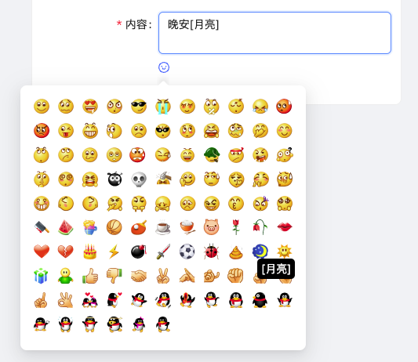

# Preview



```shell
npm i
npm run dev
```

# Usage

```
npm i vue-wechat-emoji-picker --save
```

### simple
```vue
<WechatEmojiPicker :scale="0.5" @on-select="onSelect" />
```

### demo
```vue
<script setup lang="ts">
import { nextTick, ref } from 'vue'
import WeChatEmojiPicker from 'vue-wechat-emoji-picker'

const inputValue = ref('')

const onSelect = (emoji: string) => {
  const inputElement: any = document.getElementById('input-textarea');
  const startPos = inputElement.selectionStart;
  const endPos = inputElement.selectionEnd;

  inputValue.value =
    inputValue.value.substring(0, startPos) +
    emoji +
    inputValue.value.substring(endPos);

  inputElement.focus();
  nextTick(() => {
    const newCursorPosition = startPos + emoji.length;
    inputElement.setSelectionRange(newCursorPosition, newCursorPosition);
  })
}
</script>

<template>
  <div>
    <textarea id="input-textarea" v-model="inputValue" rows="10" style="width: 100%;"></textarea>
    <WechatEmojiPicker :scale="1" @on-select="onSelect" />
  </div>
</template>
```